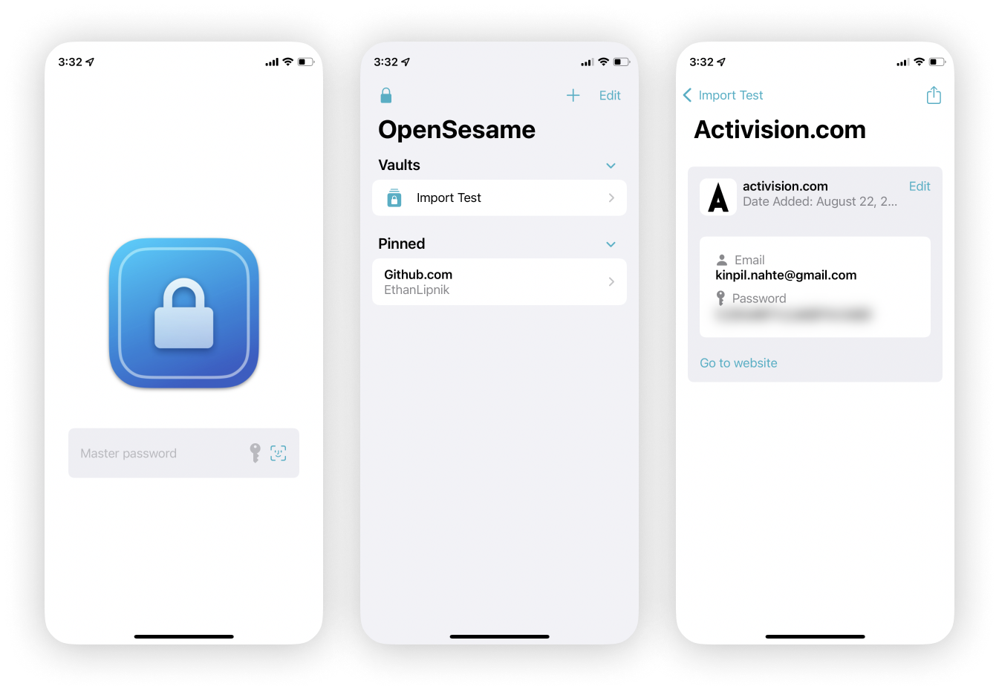
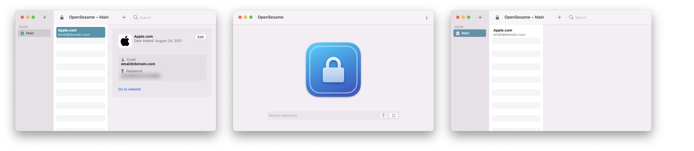

# OpenSesame

Native and encrypted password manager for iOS and macOS.

#### [Join the TestFlight](https://testflight.apple.com/join/5ZW0k48j)

## What is it?

OpenSesame is a free and powerful password manager that lets you manage your passwords with ease.

It syncs with iCloud and encrypts your data to make sure only **you** get access. No more required subscriptions, no more ram hogs, *and no more electron versions.*

## Features

- iCloud Syncing
- OTP Auth (Two Factor Authentication)
- Safari Autofill
- On-Device AES encryption
- Biometrics unlock
- Pinned accounts
- Multiple vaults
- Multipeer account sharing
- Import/Export
- Password generator
- Credit/Debit card support
- Notes field
- CoreData
- 100% SwiftUI
- Native support for macOS and iOS.

## Planned Features

- Better password bulk deleting
- Menubar access
- Dropbox, Google Drive, personal server support
- OTP Autofill
- OTP QR codes
- Password suggestions (detect if password is secure)
- Compromised/breached password notice
- Chrome & native Windows support

## Why use OpenSesame

Now more than ever, what was previously amazing native apps have become slow and big web apps. Big apps take more control away from the user and push subscriptions and other payment models without much reason. OpenSesame aims to fix that by giving a free and open source password manager that is native and performant. Still get all the great features of other password managers without all the baggage.

## Requirements

- Xcode 13+
- macOS 12+
- iOS 15+

## License

OpenSesame is available under the MIT license. See the LICENSE file for more info.

## Acknowledgements

OpenSesame depends on the following open-source projects:

* [SwiftOTP](https://github.com/OpenSesameManager/SwiftOTP.git) by [lachlanbell](https://github.com/lachlanbell) ([License](https://github.com/lachlanbell/SwiftOTP/blob/master/LICENSE))
* [FaviconFinder](https://github.com/will-lumley/FaviconFinder.git) by [will-lumley](https://github.com/will-lumley) ([License](https://github.com/will-lumley/FaviconFinder/blob/main/LICENSE.txt))
* [KeychainAccess](https://github.com/kishikawakatsumi/KeychainAccess.git) by [kishikawakatsumi](https://github.com/kishikawakatsumi) ([License](https://github.com/kishikawakatsumi/KeychainAccess/blob/master/LICENSE))
* [DomainParser](https://github.com/Dashlane/SwiftDomainParser.git) by [Dashlane](https://github.com/Dashlane) ([License](https://github.com/Dashlane/SwiftDomainParser/blob/master/LICENSE))
* [CSV.swift](https://github.com/yaslab/CSV.swift.git) by [yaslab](https://github.com/yaslab) ([License](https://github.com/yaslab/CSV.swift/blob/master/LICENSE))
* [MultipeerKit](https://github.com/insidegui/MultipeerKit.git) by [insidegui](https://github.com/insidegui) ([License](https://github.com/insidegui/MultipeerKit/blob/main/LICENSE))
